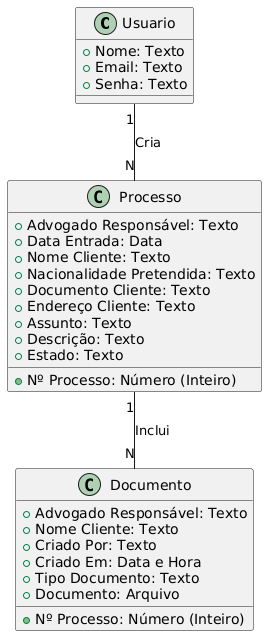

# Programação Funcionalidades

## Requisitos Atendidos

As tabelas que se seguem apresentam os requisitos que relacionam o escopo do projeto com os artefatos criados:

### Requisitos Funcionais

|ID    | Descrição do Requisito | Responsável | Artefato Criado |
|------|------------------------|------------|-----------------|
| RF01 | Permitir que o advogado faça login utilizando credenciais válidas | Lucas Santos | register.html |
| RF02 | Permitir que o advogado crie um novo processo jurídico | Erick Albuquerque | create.html |
| RF03 | Permitir que o advogado visualize a lista de todos os processos | Daniel Freitas e Carolina Araujo | list.html |
| RF04 | Permitir que o advogado aplique free filter na lista de processos | Carolina Araujo | list.html |
| RF05 | Permitir que o advogado visualize os detalhes de um processo específico | Gabriel Lemos | view.html |
| RF06 | Permitir que o advogado edite informações de um processo existente | Carolina Araujo | update.html |
| RF07 | Permitir que o advogado faça upload de documentos para um processo | Carolinha Araujo | upload.html|
| RF08 | Permitir que o advogado faça download de documentos do cliente | Carolina Araujo | documents.html |
| RF09 | Permitir que o advogado realize logout | Daniel Freitas | list.html |
| RF10 | Permitir que o cliente faça login utilizando credenciais válidas | Lucas Santos | register.html |
| RF11 | Permitir que o cliente visualize a lista dos seus processos | Daniel Freitas e Carolina Araujo| list.html |
| RF12 | Permitir que o cliente visualize os detalhes do seu processo | Gabriel Lemos | view.html |
| RF13 | Permitir que o cliente faça upload de documentos pessoais | Carolina Araujo | upload.html |
| RF14 | Permitir que o cliente faça download dos documentos do processo | Carolina Araujo | documents.html |
| RF15 | Permitir que o cliente realize logout | Daniel Freitas | list.html |

 

## Descrição das estruturas de dados:

### Usuário
|  **Nome**                | **Tipo**          | **Descrição**                                | **Exemplo**                                                                     |
|--------------------------|-------------------|----------------------------------------------|---------------------------------------------------------------------------------|
| Nome                     | Texto             | Nome completo do usuário (cliente/advogado)  | Maria Alice dos Santos                                                          |
| Email                    | Texto             | Endereço de email do usuário                 | maria.alice@gmail.com                                                           |
| Senha                    | Texto             | Senha para autenticação                      | senh@Segura7049#                                                                |

### Processo
|  **Nome**                | **Tipo**          | **Descrição**                                | **Exemplo**                                                                     |
|--------------------------|-------------------|----------------------------------------------|---------------------------------------------------------------------------------|
| Nº Processo              | Número (Inteiro)  | Identificador único do processo              | 1321                                                                            |
| Advogado Responsável     | Texto             | Advogado responsável por conduzir o caso     | Bruno Rodrigues da Silva                                                        |
| Data Entrada             | Data              | Data de entrada do processo                  | 2024-10-20                                                                      |
| Nome Cliente             | Texto             | Nome completo do(a) cliente                  | Maria Alice dos Santos                                                          |
| Nacionalidade Pretendida | Texto             | Nacionalidade que o(a) cliente deseja obter  | Portuguesa                                                                      |
| Documento Cliente        | Texto             | Documento de identificação do(a) cliente     | 343.343.343-93                                                                  |
| Endereço Cliente         | Texto             | Endereço completo do(a) cliente              | Av. da Saudade, 1934 - Ap 12, Vila Diamanete, São Paulo - SP                    |
| Assunto                  | Texto             | Assunto relacionado ao processo              | Nacionalidade Cônjuge                                                           |
| Descrição                | Texto             | Detalhes adicionais sobre o processo         | O processo refere-se à aquisição de nacionalidade portuguesa através de cônjuge |
| Estado                   | Texto             | Estado atual do processo (em andamento/concluído/suspenso) | Em Andamento                                                      |

### Documento
|  **Nome**                | **Tipo**          | **Descrição**                                | **Exemplo**                                                                     |
|--------------------------|-------------------|----------------------------------------------|---------------------------------------------------------------------------------|
| Nº Processo              | Número (Inteiro)  | Identificador único do processo              | 1321                                                                            |
| Advogado Responsável     | Texto             | Advogado responsável por conduzir o caso     | Bruno Rodrigues da Silva                                                        |
| Nome Cliente             | Texto             | Nome completo do(a) cliente                  | Maria Alice dos Santos                                                          |
| Criado Por               | Texto             | Nome da pessoa responsável pela criação do registro no sistema | Bruno Rodrigues da Silva                                      |
| Criado Em                | Data e Hora       | Data e hora em que o documento foi criado    | 2024-10-24 14:30                                                                |
| Tipo Documento           | Texto             | Categoria do documento a ser carregado       | Contrato                                                                        |
| Documento                | Arquivo           | Documento a ser carregado no formato PDF     | contrato.pdf                                                                    |

 

## Diagrama Entidade-Relacionamento

