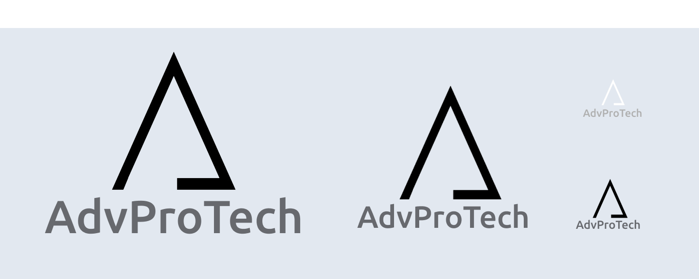

# Template Padrão Aplicação

A identidade visual da plataforma foi cuidadosamente desenvolvida para refletir seriedade, transparência e profissionalismo, visto de tratar de um aplicativo voltado a escritórios de advocacia especializados em aquisição de nacionalidade. A combinação de cores, tipografia e iconografia resulta em uma interface intuitiva que permite a visualização clara de um maior volume de informações, sem criar poluição visual, e proporciona uma experincia agradável e harmoniosa.
  

## Design

**Logotipo**

O logotipo do aplicativo foi cuidadosamente elaborado para refletir a identidade visual da plataforma, incorporando um design moderno e simplificado. Sua simplicidade e clareza asseguram um reconhecimento imediato, facilitando a memorização e estabelecendo uma conexão direta com os usuários. 
 

 

**Estrtura Geral Layout**

A estrutura geral do layout da aplicação adota um design padrão para aplicações web, composta por uma sidebar, uma topbar e um conteúdo central. Essa configuração facilita o acesso às principais funcionalidades do aplicativo.

A inclusão de breadcrumbs, posicionados na parte superior do conteúdo, proporciona um contexto de navegação claro e fluido, permitindo que os usuários localizem rapidamente sua posição dentro da plataforma e retornem a seções anteriores com facilidade.

Esse design assegura uma interação eficiente com a plataforma, maximizando a produtividade e a satisfação do usuário.

  

  

## Cores

A paleta de cores apresenta uma seleção equilibrada de tons neutros e suaves, que transmitem confiança e tranquilidade, elementos essenciais no contexto jurídico. Cores de destaque são utilizadas exclusivamente para indicar status, assegurando que as informações importantes sejam facilmente identificáveis. 

- Cores de Fundo: O branco (#FFFFFF) e um tom de cinza claro (#E2E8F0) oferecem um fundo limpo e neutro, ajudando a destacar as informações e promover uma experiência de leitura confortável.

- Cores dos Textos: Variam entre o cinza escuro (#242424), que favorece a leitura de textos longos, e o branco (#FFFFFF), utilizado sobre fundos escuros para melhorar a legibilidade. Há também toques de cores como o azul claro (#67696F) que transmitem uma mensagem de positividade e progresso.

- Cores de Destaque: Foram incluídas cores como vermelho (#D34053), laranja (#FFA70B) e verde (#219653) para destacar informações importantes.
  
 

 

## Tipografia

A tipografia usada é a Ubuntu, com variações de peso Regular, Medium, e Bold que permitem uma hierarquia clara e organizada das informações. Esse tipo de letra é conhecido pela sua legibilidade, mesmo em tamanhos menores, e adiciona um toque moderno sem perder a formalidade necessária ao contexto jurídico. As variações de tamanho (de 12px a 28px) são bem distribuídas para facilitar a leitura e o entendimento das informações, permitindo que o usuário consiga navegar por muitas informações sem se sentir sobrecarregado.

 

 

## Iconografia

Os ícones utilizados na aplicação são apresentados de maneira clara, tornando as ações da plataforma autoexplicativas, contribuindo para a navegação intuitiva da plataforma. Essa iconografia reforça a transparência e facilita o entendimento das funcionalidades, mesmo para aqueles que não possuem um alto nível de familiaridade com tecnologia.

 

