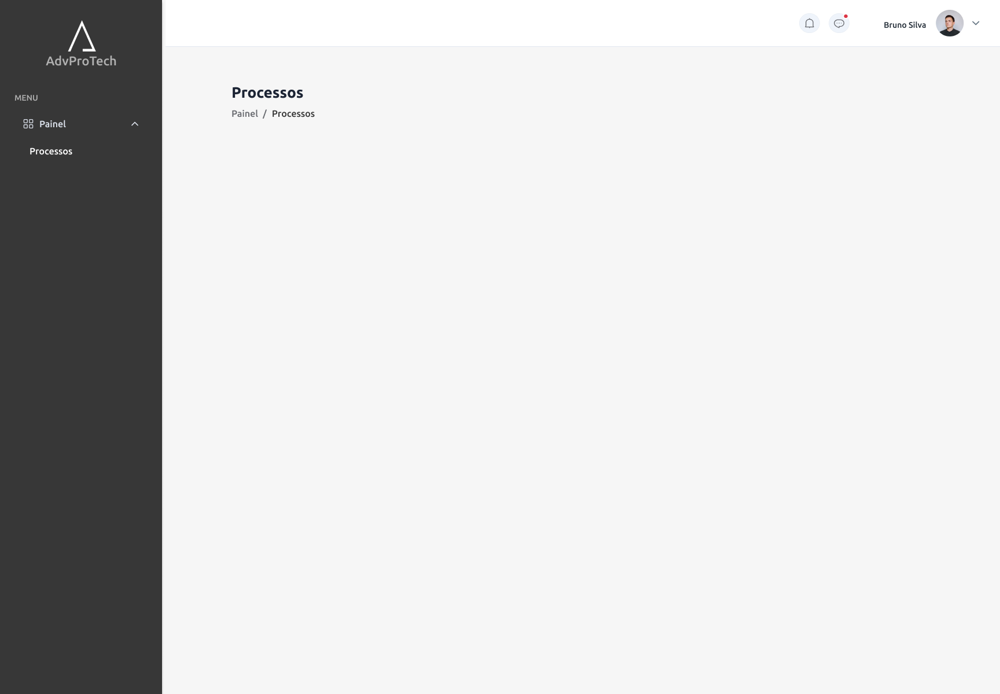

# Template Padrão Aplicação

## Design

  **Estrutura Geral do Layout**
   
  O layouts segue um design padrão de aplicações web, com:
  
  Barra Lateral Esquerda (Sidebar): Barra lateral na esquerda que contém um menu fixo com as opções de sessão de processos.
  
  Área Central de Conteúdo: As telas contém uma área central onde o conteúdo principal é exibido, como listagem de processos e formulários.
  
  Cabeçalho Superior (Header): Notificações e o perfil do usuário.

  Logo: A logo está inserido na barra lateral esquerda no topo, em todos os layouts, para identificação visual do aplicativo.

  Outros componentes visuais:

 

## Cores

O aplicativo utiliza a seguinte paleta de cores:

 

## Tipografia

O aplicativo utiliza a seguinte tipografia:

 

## Iconografia

O aplicativo utiliza a seguinte iconografia:

