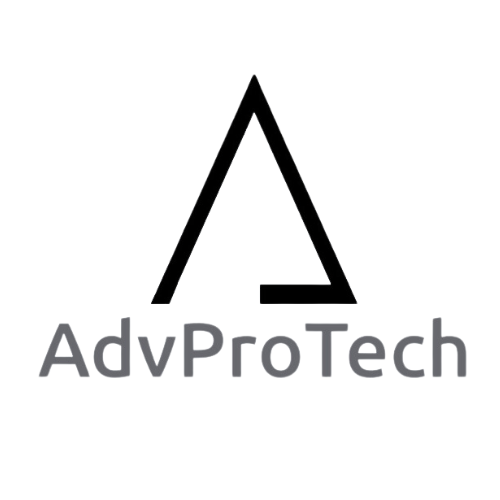

# Apresentação

Faça uma apresentação de um resumo de todos o processo de desenvolvimento e no final apresente a solução desenvolvida, usando um pequeno vídeo.

Liste os arquivos produzidos e postados nesta pasta, com suas localizaçãoes e descrição do conteúdo neste arquivo Readme.md.

* [Apresentação final](./presentation.pdf) -- arquivo com os slides da apresentação final
* [Vídeo de demonstração](./advprotech_video.mp4) -- arquivo com a demonstração do funcionamento do sistema

## Título do Projeto

AdvProTech - Gestão e Acompanhamento de Processos

## Identidade Visual (Marca, Design)

## Conjunto de Slides (Estrutura)

[Apresentação final](./presentation.pdf)

## Vídeo de demonstração

[Vídeo de demonstração](./advprotech_video.mp4)

